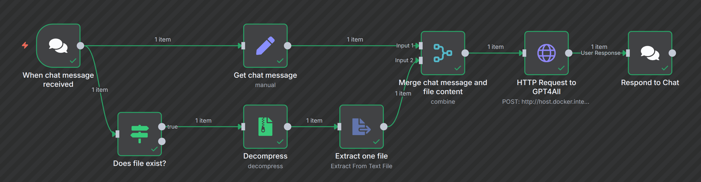
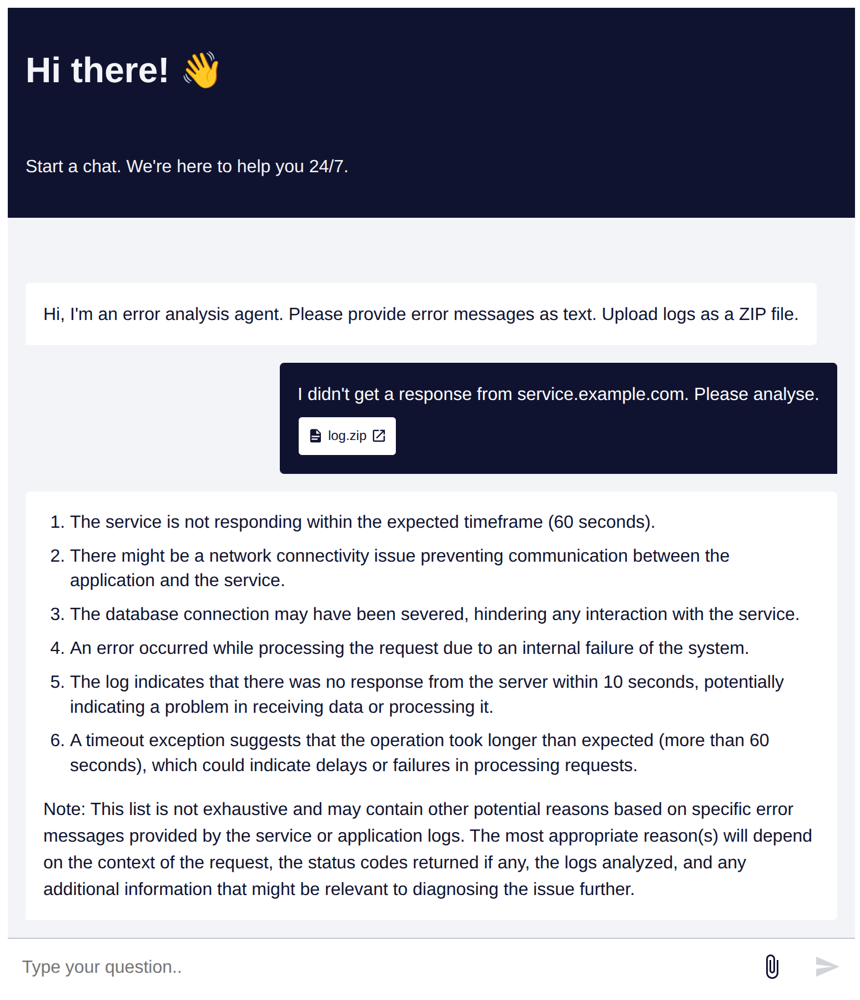

# n8n

The setup in the current project uses a local n8n instance as well as a local GPT4All instance.

## Workflow



## Chat



## Setup

### GPT4All

* Install GPT4All
* Enable local API server
* Install model qwen2.5-coder-1.5b-instruct-q4_0.gguf in GPT4All

### socat

* Install socat ```sudo apt install socat```
* Start socat ```socat TCP-LISTEN:4892,fork,reuseaddr TCP:127.0.0.1:4891```

### Filesystem

* Create a directory "n8n" in /home/user

### Start

* Start Docker: ```docker-compose up```
* Open http://localhost:5678/home/workflows in browser
* Open Workflow
* Get chat URL from trigger node
* Replace webhookUrl in chat.html with value from trigger node
* Open chat.html in browser

## Improvements

* Error handling in workflow
* Support for multiple files to extract